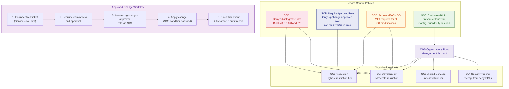

# Task 2.2 — Preventive SCP Architecture

## Architecture Diagram — Policy Enforcement Points

## Policy Enforcement Summary

| SCP | Applied To | Blocks | Allows Via |
|-----|-----------|--------|-----------|
| DenyPublicIngressRules | Prod + Dev OUs | 0.0.0.0/0 and ::/0 ingress | No exceptions — absolute deny |
| RequireApprovedRole | Production OU only | All SG changes from non-approved principals | Assumption of sg-change-approved role |
| RequireMFAForSG | Prod + Dev OUs | SG changes without MFA session | MFA-enabled sessions |
| ProtectAuditInfra | Root (all accounts) | Deletion of CloudTrail, Config, GuardDuty | SecurityTeamAdmin role only |
